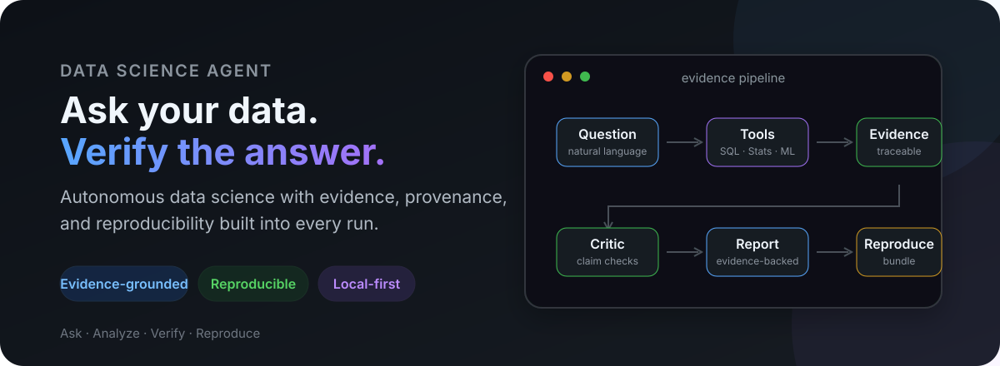
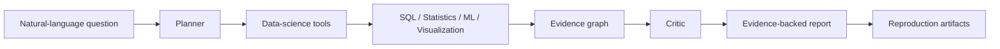

<div align="center">

# Data Science Agent

### The AI data scientist that shows its work.

Ask questions about CSV files and databases in natural language. DSA runs SQL, statistics, machine learning, and visualization, then returns **reproducible artifacts with claim-level evidence**.

[**Quickstart**](#-60-second-quickstart) ·
[**See it in action**](#-see-it-in-action) ·
[**Case studies**](case-studies/) ·
[**Evaluation**](docs/evaluation.md) ·
[**Docs**](docs/getting-started.md) ·
[**Roadmap**](ROADMAP.md)

[](https://github.com/Jackxiaozhiren/data-science-agent/actions/workflows/ci.yml)
[](https://github.com/Jackxiaozhiren/data-science-agent/actions/workflows/codeql.yml)
[](https://pypi.org/project/jack-data-science-agent/)
[](https://pypi.org/project/jack-data-science-agent/)
[](LICENSE)
[](https://github.com/Jackxiaozhiren/data-science-agent/stargazers)

<br />



</div>

---

## Why DSA?

Most AI data-analysis tools stop at the answer.

**Data Science Agent is built to preserve the path from a claim back to the computation and dataset that produced it.**

```text
Question
   ↓
Executed analysis
   ↓
Evidence
   ↓
Claim
   ↓
Reproducible report
```

That means an analysis can be **inspected, audited, reproduced, and challenged** instead of accepted on confidence alone.

> **If an AI makes a data-science claim, you should be able to inspect how it got there.**

---

## ⚡ 60-second quickstart

Install:

```bash
pip install jack-data-science-agent
```

Run the built-in demo:

```bash
dsa demo
```

Analyze your own data:

```bash
dsa analyze sales.csv \
  --task "Which factors explain revenue, and are the effects statistically significant?"
```

Python **3.12+** is required.

A successful run produces more than chat output:

```text
analysis run
├── report.md
├── experiment.json
├── evidence_graph.json
├── analysis.ipynb
└── reproduce.sh
```

| Artifact | Purpose |
|---|---|
| `report.md` | Human-readable findings |
| `experiment.json` | Structured run metadata |
| `evidence_graph.json` | Claim → evidence → computation lineage |
| `analysis.ipynb` | Inspectable notebook representation |
| `reproduce.sh` | Re-run the analysis |

---

## See it in action

<div align="center">



<sub>Question → profile → plan → tools → evidence → critic → reproducible report.</sub>

</div>

### Start with 3 flagship workflows

| Workflow | Ask DSA | What it demonstrates |
|---|---|---|
| **[Sales analytics](case-studies/01-sales/)** | What drives revenue across regions and categories? | SQL + statistics → evidence → reproducible report |
| **[Time-series forecasting](case-studies/03-time-series/)** | What are the next 30 values, and how well does the baseline forecast perform? | Forecasting, holdout evaluation, reproducibility, and visible failure recovery |
| **[ML classification](case-studies/08-classification/)** | Can DSA train, evaluate, and explain an imbalanced classifier? | Model evaluation + feature importance inside the same provenance trail |

**[Browse all 8 verified case studies →](case-studies/)**

These are verified repository workflows intended to show product behavior and evidence artifacts. They are **not** presented as independent real-LLM leaderboard results.

---

## What makes DSA different?

### 1. Claim-level evidence

Supported findings can be connected to the analysis that produced them:

```text
Claim
└── statistical result
    └── executed tool
        └── parameters
            └── dataset SHA-256
```

### 2. Reproducibility by default

DSA records run metadata and reproduction artifacts instead of treating the final prose answer as the only output.

### 3. Evidence-aware critique

A critic stage checks whether conclusions go beyond available evidence. For example, causal language can be rejected when the underlying analysis only supports correlation.

### 4. Real data-science tools

Core workflows can coordinate:

- dataset profiling and exploratory analysis
- SQL with DuckDB
- statistical testing
- regression and classification
- forecasting and feature importance
- visualization
- report generation

### 5. One runtime, multiple interfaces

| Surface | Entry point |
|---|---|
| CLI | `dsa <command>` |
| Python SDK | `from data_science_agent import Agent` |
| REST API | FastAPI |
| Streaming | Server-Sent Events |
| MCP | MCP server |
| Jupyter | `%load_ext dsa_jupyter` |
| VS Code | Dataset explorer + analysis replay |
| Plugins | Custom data-science tools |

---

## Python SDK

```python
import asyncio
from data_science_agent import Agent

async def main():
    result = await Agent().analyze(
        "sales.csv",
        "Which region drives the most revenue, and is the trend statistically significant?",
    )

    print(result.report_markdown)

asyncio.run(main())
```

Inspect evidence programmatically:

```python
for evidence in result.evidence:
    print(evidence.claim)
    print(evidence.source_id)
    print(evidence.result)
```

---

## Case study gallery

The repository includes verified end-to-end examples across business analytics, churn, forecasting, marketing, finance, public statistics, data quality, and classification.

**[Browse the Case Study Gallery →](case-studies/)**

A useful way to evaluate DSA is to start with the question you would ask about your own dataset, then inspect the generated report and evidence trail.

---

## Evaluation

DSA is developed against versioned benchmark suites rather than relying only on hand-picked demos.

The repository currently contains deterministic benchmark and evaluator-validation results, including frozen task suites and reproducibility checks. These results are useful for regression testing and validating the evaluation harness, but **they should not be interpreted as an independent comparison of real LLM model quality unless the run identifies a real model/provider and reproducible configuration**.

The current public result registry includes a `stub/small` validation run. It is intentionally labeled as such so test-harness scores are not confused with real-model performance.

- [Evaluation methodology](docs/evaluation.md)
- [Benchmark documentation](docs/benchmark.md)
- [Reproducible result registry](benchmarks/leaderboard/)
- [Research & limitations](docs/research.md)

**Next evaluation gate:** run the merged credentialed four-way real-model smoke workflow, review all raw artifacts for reproducibility, and only then prepare any full-catalog comparative result for publication.

---

## Architecture



The runtime uses a LangGraph-based orchestration layer over typed data-science tools, with local-first data operations built around Python, DuckDB, Polars, SciPy, scikit-learn, and Matplotlib.

---

## DSA vs. typical AI data analysis

| Capability | Chat-with-data tools | Generic coding agents | Data Science Agent |
|---|:---:|:---:|:---:|
| Natural-language analysis | ✓ | ✓ | ✓ |
| SQL / statistics / ML | ✓ | ✓ | ✓ |
| Autonomous workflow | Limited | ✓ | ✓ |
| Dataset hashing | — | — | ✓ |
| Claim-level evidence | — | — | ✓ |
| Evidence graph | — | — | ✓ |
| Reproduction bundle | Limited | Limited | ✓ |
| Evidence-aware critic | — | — | ✓ |
| MCP interface | Varies | Varies | ✓ |
| Plugin runtime | Varies | Varies | ✓ |

DSA is not intended to be only another natural-language interface to a dataframe.

Its focus is **verifiable, reproducible AI data science**.

---

## Documentation

Start here:

- [Getting Started](docs/getting-started.md)
- [SDK & API Reference](docs/api.md)
- [Evaluation](docs/evaluation.md)
- [Benchmarks](docs/benchmark.md)
- [MCP](docs/mcp.md)
- [Research & Limitations](docs/research.md)
- [Case Studies](case-studies/)
- [Roadmap](ROADMAP.md)
- [Changelog](CHANGELOG.md)
- [Releases](https://github.com/Jackxiaozhiren/data-science-agent/releases)

---

## Development

```bash
git clone https://github.com/Jackxiaozhiren/data-science-agent.git
cd data-science-agent
uv sync --dev
uv run dsa demo
uv run pytest
```

Static checks:

```bash
uv run ruff check .
uv run mypy .
```

---

## Contributing

Contributions are welcome, especially:

- real-model benchmark baselines
- reproducibility failures
- new datasets and benchmark tasks
- statistical validation improvements
- data-science tools and plugins
- case studies and documentation

**New contributor?** Start with the [`good first issue`](https://github.com/Jackxiaozhiren/data-science-agent/issues?q=is%3Aissue+is%3Aopen+label%3A%22good+first+issue%22) queue.

See [CONTRIBUTING.md](CONTRIBUTING.md), [ROADMAP.md](ROADMAP.md), and [CODE_OF_CONDUCT.md](CODE_OF_CONDUCT.md).

---

## Citation, security, and license

- Academic use: [CITATION.cff](CITATION.cff)
- Security reports: [SECURITY.md](SECURITY.md)
- License: [MIT](LICENSE)

---

<div align="center">

### Ask. Analyze. Verify. Reproduce.

[Get Started](docs/getting-started.md) ·
[Case Studies](case-studies/) ·
[Evaluation](docs/evaluation.md) ·
[Roadmap](ROADMAP.md) ·
[Contribute](CONTRIBUTING.md)

⭐ If reproducible AI data analysis is useful to you, consider starring the project.

</div>
