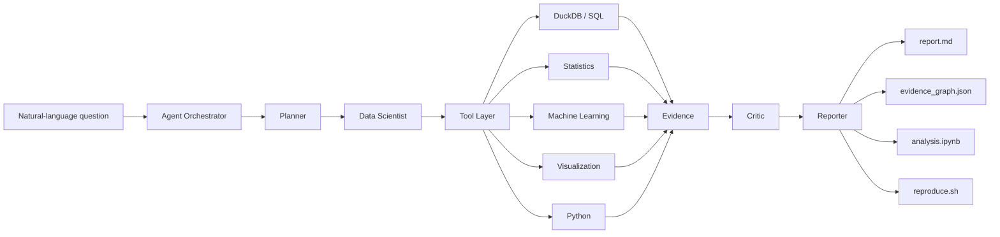

<div align="center">

# Data Science Agent

### Evidence-grounded autonomous data science — from question to reproducible analysis.

Ask questions about your data in natural language.  
Get statistics, SQL, machine learning, visualizations, and reports — with **every important claim traceable back to the computation and dataset that produced it**.

[**Quickstart**](#-quickstart) ·
[**Case Studies**](case-studies/) ·
[**Leaderboard**](benchmarks/leaderboard/) ·
[**Evaluation**](#-evaluation) ·
[**Roadmap**](ROADMAP.md) ·
[**Documentation**](docs/getting-started.md) ·
[**Releases**](https://github.com/Jackxiaozhiren/data-science-agent/releases) ·
[**Contributing**](CONTRIBUTING.md)

[](https://github.com/Jackxiaozhiren/data-science-agent/actions/workflows/ci.yml)
[](https://github.com/Jackxiaozhiren/data-science-agent/actions/workflows/codeql.yml)
[](https://pypi.org/project/jack-data-science-agent/)
[](https://github.com/Jackxiaozhiren/data-science-agent/releases/latest)
[](https://pypi.org/project/jack-data-science-agent/)
[](LICENSE)
[](CONTRIBUTORS.md)

[](docs/evaluation.md)
[](docs/contributing.md)
[](case-studies/)
[](https://github.com/Jackxiaozhiren/data-science-agent/stargazers)

<br />


</div>

---

## Why Data Science Agent?

Most AI data-analysis tools can generate an answer.

**Data Science Agent is designed to show where that answer came from.**

For every supported insight, DSA can preserve the chain:

```text
Insight
   ↓
Evidence
   ↓
Tool Call
   ↓
Computation
   ↓
Dataset (SHA-256)
```

That means an analysis does not have to be accepted on faith. It can be **inspected, audited, reproduced, and challenged**.

```python
import asyncio
from data_science_agent import Agent

result = asyncio.run(
    Agent().analyze(
        "sales.csv",
        "Does price predict revenue, and is the effect statistically significant?",
    )
)

print(result.report_markdown)
print(result.evidence)
```

---

## ⚡ Quickstart

### Install

```bash
pip install jack-data-science-agent
```

Python **3.12+** is required.

### Run the demo

```bash
dsa demo
```

### Analyze your own data

```bash
dsa analyze sales.csv \
  --task "Which factors explain revenue, and are the effects statistically significant?"
```

That's it.

DSA profiles the dataset, plans the analysis, executes tools, evaluates the results, and produces an evidence-backed report.

> Developing from source? Run `uv sync --dev`, then use `uv run dsa ...`.

---

## See It in Action

<div align="center">


<sub>Question → profile → plan → tools → evidence → critic → reproducible report. The demo loops every 18 seconds.</sub>

</div>

---

## What You Get

A successful analysis produces more than a text response.

```text
analysis run
├── report.md
├── experiment.json
├── evidence_graph.json
├── analysis.ipynb
└── reproduce.sh
```

| Artifact | Purpose |
|---|---|
| `report.md` | Human-readable analysis and findings |
| `experiment.json` | Structured run metadata |
| `evidence_graph.json` | Claim → evidence → computation lineage |
| `analysis.ipynb` | Inspectable notebook representation |
| `reproduce.sh` | Re-run the analysis |

The goal is simple:

> **If an AI makes a data-science claim, you should be able to inspect how it got there.**

---

## Core Capabilities

### Evidence-grounded analysis

Every supported insight can be connected to an evidence record and the dataset used to produce it.

```text
Insight → Evidence → ToolCall → Dataset(sha256)
```

This makes generated analysis easier to audit than ordinary conversational output.

### Reproducibility by default

DSA records analysis artifacts rather than treating the final answer as the only output. Runs can be inspected and reproduced using the generated experiment metadata and reproduction bundle.

### Autonomous data-science workflow

The agent can coordinate multiple stages of analysis:

- dataset profiling
- exploratory analysis
- SQL
- statistical testing
- regression
- classification
- forecasting
- feature importance
- visualization
- report generation

### Evidence-aware critic

A critic stage checks whether generated conclusions go beyond the available evidence. For example, unsupported causal language can be rejected when the underlying analysis only establishes correlation.

### Local-first execution

Core data operations run locally using technologies including:

- DuckDB
- Polars
- Python
- SciPy
- scikit-learn
- Matplotlib

The architecture is designed so that core workflows are not dependent on a proprietary data-processing backend.

### Multiple interfaces, one runtime

Use the same analysis system through:

| Surface | Entry point |
|---|---|
| CLI | `dsa <command>` |
| Python SDK | `from data_science_agent import Agent` |
| REST API | FastAPI API |
| Streaming | Server-Sent Events |
| MCP | MCP server |
| Jupyter | `%load_ext dsa_jupyter` |
| VS Code | Dataset explorer + analysis replay |
| Plugins | Custom data-science tools |

---

## How It Works



At a high level:

```text
Question
   │
   ▼
Planner
   │
   ▼
Data-science tools
   │
   ├── SQL
   ├── statistics
   ├── ML
   ├── forecasting
   └── visualization
   │
   ▼
Evidence graph
   │
   ▼
Critic
   │
   ▼
Evidence-backed report
```

The runtime uses a **LangGraph-based orchestration layer** over typed data-science tools.

Each tool execution can contribute evidence associated with the underlying dataset, allowing the reporting layer to connect conclusions to computations rather than generating unsupported prose.

---

## Example

Suppose you have `sales.csv` and ask:

```text
Does price predict revenue?
Which regions contribute the most?
Are the relationships statistically significant?
```

Run:

```bash
dsa analyze sales.csv \
  --task "Does price predict revenue, which regions contribute most, and are the relationships statistically significant?"
```

Instead of returning only:

```text
Higher price is associated with increased revenue.
```

DSA is designed to retain the supporting analysis behind that statement:

```text
Claim
 └── statistical result
      └── executed tool
           └── parameters
                └── dataset hash
```

This distinction is central to the project.

---

## Python SDK

### Analyze a dataset

```python
import asyncio
from data_science_agent import Agent

async def main():
    agent = Agent()

    result = await agent.analyze(
        "sales.csv",
        "Which region drives the most revenue, and is the trend significant?",
    )

    print(result.report_markdown)

asyncio.run(main())
```

### Inspect evidence

```python
print(result.status)

for evidence in result.evidence:
    print(evidence.claim)
    print(evidence.source_id)
    print(evidence.result)
```

---

## CLI

```bash
dsa --help
```

The CLI provides workflows for analysis, evaluation, reproduction, plugins, and MCP integration.

Examples:

```bash
# Run an analysis
dsa analyze sales.csv \
  --task "What variables are associated with revenue?"

# Run the built-in demo
dsa demo

# Inspect available commands
dsa --help
```

When developing from the repository:

```bash
uv sync --dev
uv run dsa demo
```

---

## Evaluation

DSA is developed against frozen benchmark suites rather than relying only on hand-picked demos.

### Benchmark v1

```text
50 / 50 tasks
task_success_rate = 1.0
statistical accuracy = 1.0
SQL accuracy = 1.0
unsupported-claim rate = 0.06
```

### Benchmark v2

```text
100 / 100 tasks
task_success_rate = 1.0
30 datasets
11 categories
fixed seed: 42
```

The benchmark suite covers multiple categories of data-science work and is versioned so that changes can be evaluated against a stable reference.

**[Open the validated public benchmark leaderboard →](benchmarks/leaderboard/)**

The leaderboard is generated from structured JSON and CI-checked so public scores cannot drift away from their source data.

### Real-world case studies

The repository contains **8 / 8 verified end-to-end case studies** spanning business analytics, churn, forecasting, marketing, financial data, public statistics, data quality, and classification.

Importantly, tool failures and limitations are preserved rather than silently removed from the reported results.

**[Browse the visual Case Study Gallery →](case-studies/)**

See also:

- [`docs/benchmark.md`](docs/benchmark.md)
- [`docs/evaluation.md`](docs/evaluation.md)
- [`docs/research.md`](docs/research.md)

---

## Reproducibility

Reproducibility is treated as a product feature rather than an optional research concern.

DSA evaluates reproduction across multiple dimensions, including execution, numerical results, statistical results, evidence, and semantics.

A generated analysis can therefore be evaluated not only on whether it produced an answer, but also on whether the analysis can be reproduced consistently.

---

## DSA vs. Typical AI Data Analysis

| Capability | Chat-with-data tools | Generic coding agents | Data Science Agent |
|---|:---:|:---:|:---:|
| Natural-language analysis | ✓ | ✓ | ✓ |
| SQL / statistics / ML | ✓ | ✓ | ✓ |
| Autonomous workflow | Limited | ✓ | ✓ |
| Dataset hashing | — | — | ✓ |
| Claim-level evidence | — | — | ✓ |
| Evidence graph | — | — | ✓ |
| Reproduction bundle | Limited | Limited | ✓ |
| Benchmark suite | Varies | Varies | ✓ |
| Evidence-aware critic | — | — | ✓ |
| MCP interface | Varies | Varies | ✓ |
| Plugin runtime | Varies | Varies | ✓ |

DSA is not intended to be only another natural-language interface to a dataframe.

Its focus is:

> **autonomous data science with verifiable provenance.**

---

## Integrations

### REST API

The FastAPI application exposes the analysis runtime through an HTTP interface and supports API-based workflows plus SSE streaming.

```text
apps/api
```

### MCP

DSA exposes its tool layer through a Model Context Protocol interface. This makes the data-science capabilities usable from MCP-compatible AI systems without duplicating the underlying execution logic.

### Jupyter

Notebook workflows can use the DSA Jupyter integration:

```python
%load_ext dsa_jupyter
```

### VS Code

The repository includes a VS Code integration for working with datasets and analysis workflows from the editor.

### Plugins

Custom capabilities can be added through the plugin runtime:

```bash
dsa plugin install ...
```

Plugin packages are validated using a structured plugin manifest.

---

## Project Structure

```text
data-science-agent/
├── apps/
│   ├── api/
│   └── jupyter/
├── packages/
│   ├── agent/
│   ├── datasets/
│   ├── evaluation/
│   ├── evidence/
│   ├── execution/
│   ├── llm/
│   ├── mcp/
│   ├── ml/
│   ├── plugins/
│   ├── reports/
│   ├── statistics/
│   ├── tools/
│   └── visualization/
├── benchmarks/
├── case-studies/
├── docs/
└── tests/
```

DSA is organized as a multi-package Python workspace with a shared public package:

```python
import data_science_agent
```

---

## Design Principles

### 1. Evidence over confidence

A confident answer without traceable support is not enough.

### 2. Reproduction over screenshots

An analysis should be rerunnable, not merely visually convincing.

### 3. Tools over hallucinated computation

Numerical claims should come from executed computation whenever possible.

### 4. Explicit limitations

Failed tools, unsupported claims, and benchmark gaps should remain visible.

### 5. One runtime, multiple interfaces

CLI, SDK, API, Jupyter, MCP, and plugins should reuse the same underlying analysis system.

---

## Documentation

Start here:

- [Getting Started](docs/getting-started.md)
- [SDK & API Reference](docs/api.md)
- [Benchmarks](docs/benchmark.md)
- [Public Benchmark Leaderboard](benchmarks/leaderboard/)
- [Evaluation](docs/evaluation.md)
- [MCP](docs/mcp.md)
- [Research & Limitations](docs/research.md)
- [Case Studies](case-studies/)
- [Roadmap](ROADMAP.md)
- [Contributors](CONTRIBUTORS.md)
- [Release Announcements](docs/announcements/)
- [Security](SECURITY.md)
- [Changelog](CHANGELOG.md)
- [Releases](https://github.com/Jackxiaozhiren/data-science-agent/releases)

---

## Development

Clone the repository:

```bash
git clone https://github.com/Jackxiaozhiren/data-science-agent.git
cd data-science-agent
```

Install the development environment:

```bash
uv sync --dev
```

Run the demo:

```bash
uv run dsa demo
```

Run tests:

```bash
uv run pytest
```

Run static checks:

```bash
uv run ruff check .
uv run mypy .
```

---

## Contributing

Contributions are welcome.

Useful ways to contribute include:

- adding benchmark tasks
- adding datasets
- implementing data-science tools
- improving statistical validation
- building plugins
- improving documentation
- reporting reproducibility failures
- fixing bugs

**New contributor?** Start with the [`good first issue`](https://github.com/Jackxiaozhiren/data-science-agent/issues?q=is%3Aissue+is%3Aopen+label%3A%22good+first+issue%22) queue.

Before submitting a pull request, see:

- [Contributing Guide](CONTRIBUTING.md)
- [Roadmap](ROADMAP.md)
- [Contributor Recognition](CONTRIBUTORS.md)
- [Code of Conduct](CODE_OF_CONDUCT.md)
- [Security Policy](SECURITY.md)

The project uses automated quality gates including tests, coverage, Ruff, mypy, documentation checks, benchmark smoke tests, container builds, and release verification.

---

## Community

The repository is structured so useful community activity feeds back into the product instead of becoming a disconnected issue queue.

- **Direction:** [`ROADMAP.md`](ROADMAP.md) documents Now / Next / Later priorities and non-goals.
- **Recognition:** [`CONTRIBUTORS.md`](CONTRIBUTORS.md) is refreshed automatically from GitHub contributor data, excluding bots.
- **Triage:** issues and pull requests receive automated labels from their content or changed paths; manual labels are preserved.
- **Maintenance:** inactive work is handled conservatively by the stale workflow, with bug, good-first-issue, security, and assigned work protected.
- **Evaluation:** [`benchmarks/leaderboard/`](benchmarks/leaderboard/) provides a structured, CI-validated public submission surface.
- **Releases:** [`docs/announcements/`](docs/announcements/) contains share-ready announcements derived from canonical GitHub Release notes.

The best contribution signal is still a reproducible problem, a clear use case, a reviewed patch, or verifiable benchmark evidence.

---

## Citation

If Data Science Agent is useful in academic or research work, please cite the project using [`CITATION.cff`](CITATION.cff).

GitHub can generate citation formats directly from this file.

---

## Security

For security issues, please follow the responsible disclosure process described in [SECURITY.md](SECURITY.md).

Please do not disclose security vulnerabilities through public issues.

---

## License

Data Science Agent is released under the [MIT License](LICENSE).

---

<div align="center">

### From natural language to reproducible data science.

**Ask. Analyze. Verify. Reproduce.**

[Get Started](docs/getting-started.md) ·
[Case Studies](case-studies/) ·
[Leaderboard](benchmarks/leaderboard/) ·
[Roadmap](ROADMAP.md) ·
[Good First Issues](https://github.com/Jackxiaozhiren/data-science-agent/issues?q=is%3Aissue+is%3Aopen+label%3A%22good+first+issue%22) ·
[Contribute](CONTRIBUTING.md)

</div>