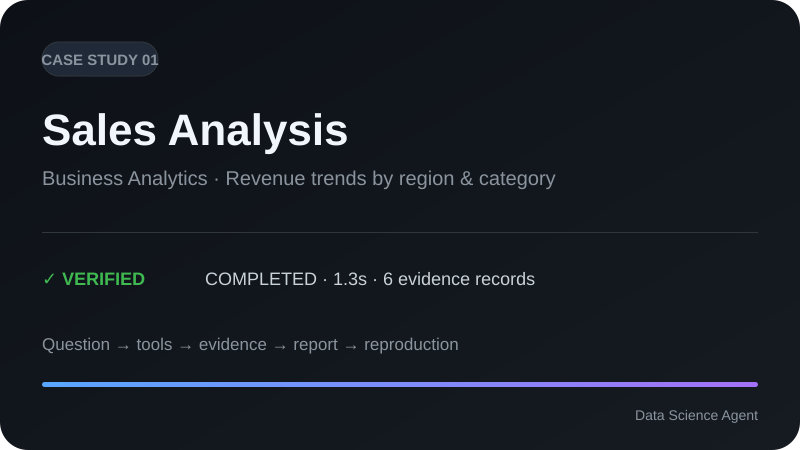
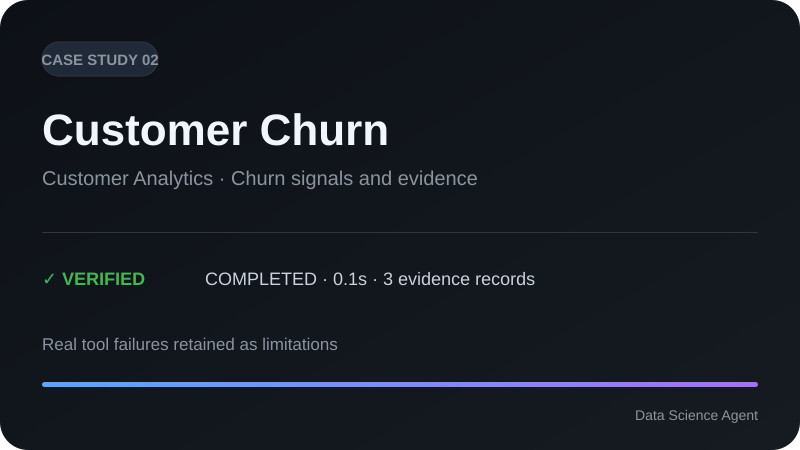
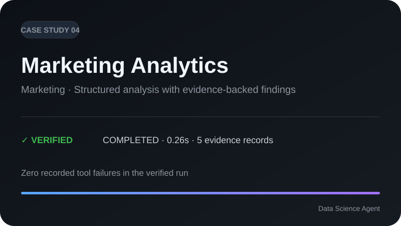
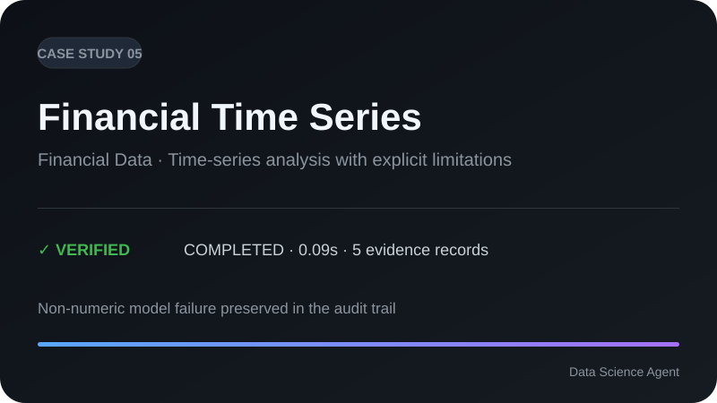
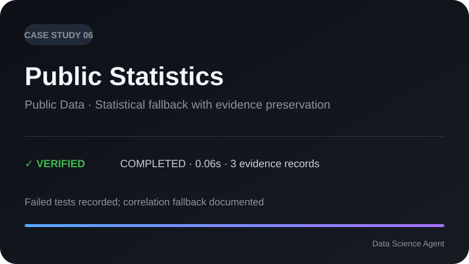
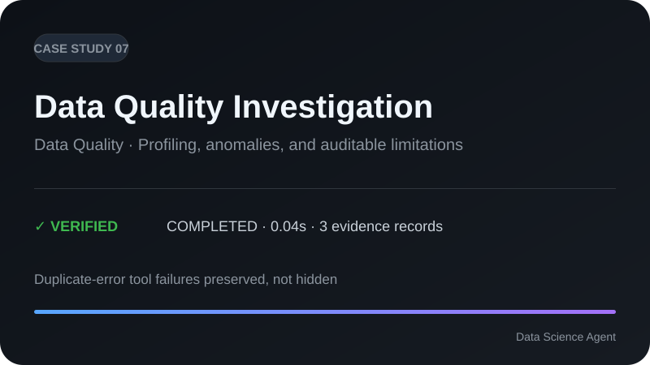
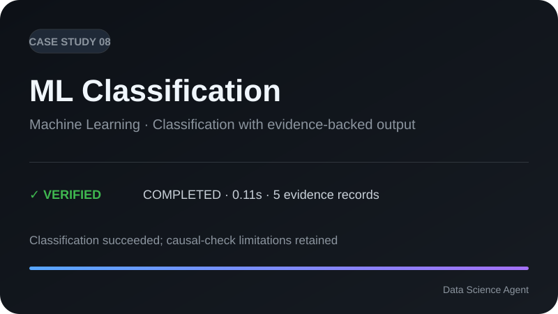

# Real-World Data Science Case Studies

**Eight verified end-to-end workflows showing what Data Science Agent can do — including the failures it does not hide.**

Every case study runs the real agent, produces evidence-backed findings, records tool failures as limitations, and generates a reproduction package. No mock outputs or hard-coded success metrics.

## Start with the flagship workflows

If you only have a few minutes, these three cases show the core product surface most clearly:

| Flagship | Question | Verified run | Why start here |
|---|---|---:|---|
| **[Business Analytics → CS01 Sales](01-sales/)** | What drives revenue across regions and categories? | `COMPLETED` · 1.33s · 6 evidence | Fastest path from a stakeholder question to SQL/statistics/evidence/report |
| **[Forecasting → CS03 Time Series](03-time-series/)** | What are the next 30 values, and how well does the baseline forecast perform? | `COMPLETED` · 1.284s · 5 evidence | Shows temporal analysis, reproducibility, and honest recovery from tool failures |
| **[Machine Learning → CS08 Classification](08-classification/)** | Can DSA train, evaluate, and explain an imbalanced classifier? | `COMPLETED` · 0.113s · 5 evidence | Shows model evaluation and feature importance inside the same provenance model |

The other five cases broaden coverage across churn, marketing, finance, public statistics, and data quality. They remain important evaluation cases, especially where recorded failures expose capability boundaries.

<div align="center">

<a href="01-sales/"></a>
<a href="02-churn/"></a>

<a href="03-time-series/"></a>
<a href="04-marketing/"></a>

<a href="05-financial/"></a>
<a href="06-public-statistics/"></a>

<a href="07-data-quality/"></a>
<a href="08-classification/"></a>

</div>

## At a glance

| Case | Domain | Verified run | Evidence | What it demonstrates |
|---|---|---:|---:|---|
| [CS01 Sales](01-sales/) | Business Analytics | `COMPLETED` · 1.3s | 6 | Revenue analysis by region/category |
| [CS02 Churn](02-churn/) | Customer Analytics | `COMPLETED` · 0.1s | 3 | Churn analysis with failed tools retained |
| [CS03 Time Series](03-time-series/) | Forecasting | `COMPLETED` · 1.28s | 5 | Temporal workflow + reproducible outputs |
| [CS04 Marketing](04-marketing/) | Marketing | `COMPLETED` · 0.26s | 5 | Clean end-to-end run with zero tool failures |
| [CS05 Financial](05-financial/) | Financial Data | `COMPLETED` · 0.09s | 5 | Financial time-series analysis + explicit limitations |
| [CS06 Public Statistics](06-public-statistics/) | Public Statistics | `COMPLETED` · 0.06s | 3 | Statistical fallback behavior preserved in evidence |
| [CS07 Data Quality](07-data-quality/) | Data Quality | `COMPLETED` · 0.04s | 3 | Profiling / quality investigation + recorded failures |
| [CS08 Classification](08-classification/) | Machine Learning | `COMPLETED` · 0.11s | 5 | Classification workflow + causal-check limitations |

## What every case contains

Each case follows the same evidence-first structure:

`Problem → Dataset → Question → Analysis Plan → Agent Trajectory → Tools → Statistics / Model → Evidence → Visualization → Report → Limitations → Reproduction`

A case is only considered verified when it:

- runs from a clean environment;
- executes the real agent rather than mocked output;
- generates real tool calls and evidence;
- produces a report;
- produces a reproduction package;
- keeps tool errors and limitations visible rather than deleting them from the record.

## Verification details

| Case | Report | Reproduction | Recorded limitations |
|---|---:|---:|---|
| CS01 Sales | 3,890 chars | ✅ | Real Agent, no mock |
| CS02 Churn | 2,983 chars | ✅ | 4 tool failures (`train_model` / `causal_check`) |
| CS03 Time Series | 4,526 chars | ✅ | 4 tool failures (`correlation` / `train_model`) |
| CS04 Marketing | 2,896 chars | ✅ | 0 tool failures; sales-like schema documented |
| CS05 Financial | 3,330 chars | ✅ | 2 failures; non-numeric model limitation documented |
| CS06 Public Statistics | 2,525 chars | ✅ | 4 failures; fell back to correlation |
| CS07 Data Quality | 2,669 chars | ✅ | 2 `causal_check` / duplicate-related failures |
| CS08 Classification | 3,470 chars | ✅ | 2 causal-check failures; classification succeeded |

## Dataset rules

The current eight cases use synthetic datasets generated by `scripts/generate_benchmark_v2.py` with seed `42`, avoiding unclear third-party licensing.

Each case records the dataset source/generation method, license, version, citation, download location, and SHA-256 hash. The benchmark-v2 datasets are versioned under `benchmarks/v2/`.

For future externally sourced datasets, a case must provide:

`Public Source / Clear License / Citation / Download Instructions / Version / Hash`

Do not contribute copyrighted or private datasets without explicit redistribution rights.

## Reproduce a case

```bash
# CS01 — Sales
uv run python -c "from data_science_agent import Agent; r=Agent().analyze_sync('benchmarks/v2/datasets/sales.csv', 'Analyze revenue trends by region and category'); print(r.status, len(r.evidence))"

# CS03 — Forecasting
uv run python -c "from data_science_agent import Agent; r=Agent().analyze_sync('benchmarks/v2/datasets/timeseries_trend.csv', 'Forecast next 30 periods for timeseries_trend, evaluate holdout MAE, and visualize trend.'); print(r.status, len(r.evidence))"

# CS08 — Classification
uv run python -c "from data_science_agent import Agent; r=Agent().analyze_sync('benchmarks/v2/datasets/imbalanced.csv', 'Train classification for imbalanced.csv, evaluate holdout, and report feature importance.'); print(r.status, len(r.evidence))"
```

Case outputs live under `case-studies/<id>/outputs/`. Reproduction bundles include artifacts such as `report.md`, `evidence_graph.json`, `reproduce.sh`, and `analysis.ipynb` under the corresponding generated report directory.

## Why the failures stay visible

The case studies are not a polished demo set where failed calls are removed after the fact. Recorded failures — such as model calls on incompatible schemas, duplicate-column causal checks, or hypothesis-test group-size constraints — are part of the evaluation evidence.

Those failures are useful: they expose benchmark-underrepresented failure modes and help define what the agent should improve next.

## Provenance

The eight-case suite was fully executed and verified on **2026-08-25** as part of the V4.2 real-world workflow evaluation. External reproduction work also covers multiple execution contexts under `reproduction/external/`.

For the broader evaluation model, see [`../docs/evaluation.md`](../docs/evaluation.md) and [`../docs/research.md`](../docs/research.md).
