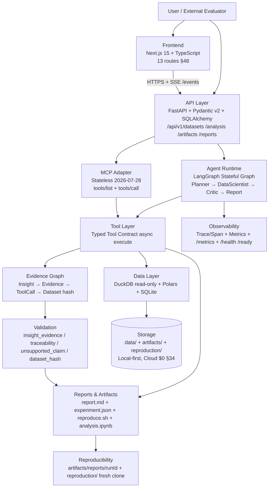
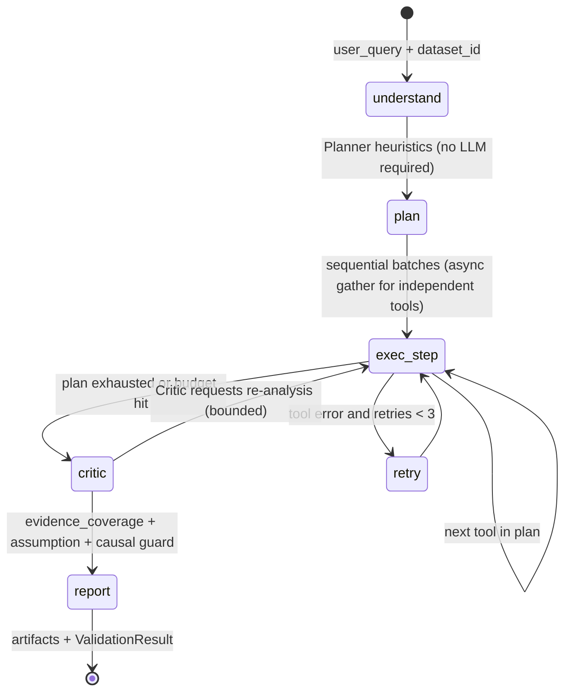
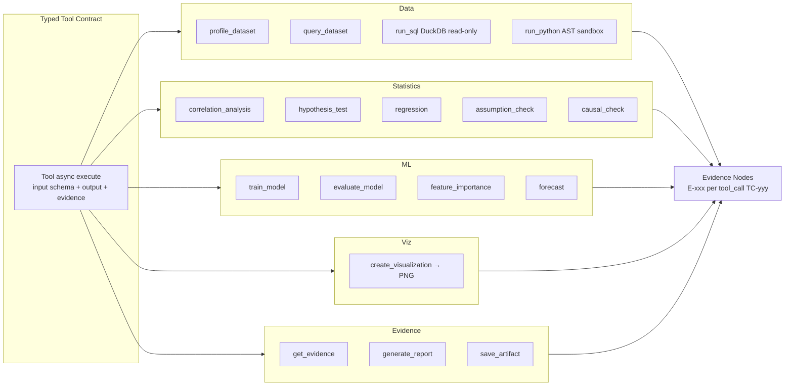
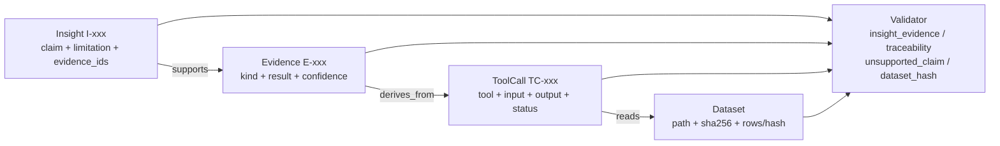
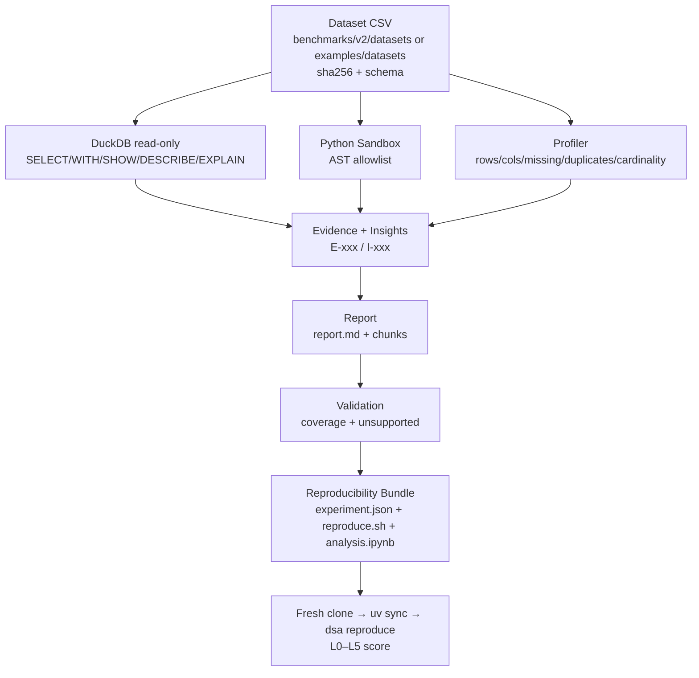
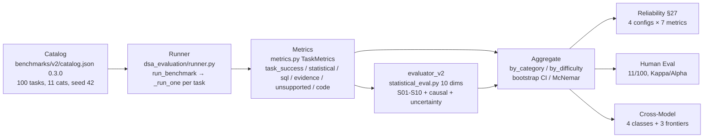
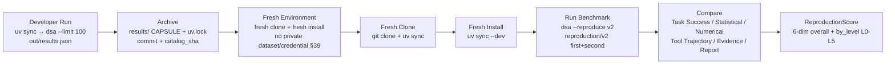

# Architecture — V3 W10 §48–49

> **Version-controlled source (§49): Mermaid diagrams in this file. System + Agent + Tool + Evidence + Lineage + Evaluation + Reproduction are all derived from live code, not slides.**

---

## 1. System Architecture (§49 Required)

**Roles**: Frontend (upload, profile, trace) → API (validation, rate limit, logging) → Agent Runtime (stateful graph, checkpoints, retry 3, `max_steps 20 / max_tool_calls 40`) → Tool Layer (17 tools) → Data/Stats/ML/Viz → Evidence → Validation → Reports/Repro. MCP is an adapter over the same Tool Layer, stateless.

---

## 2. Agent Graph (§49 Required)

Implementation: `packages/agent/src/dsa_agent/graph.py` (`run_analysis` MVP sequential) + `langgraph_graph.py` (`StateGraph` with `MemorySaver`, `checkpoint` for pause/resume/replay/fork). Budgets enforced in graph. See `docs/agent.md`.

---

## 3. Tool Architecture (§49 Required)

All tools registered via `MCP_TOOL_MAP` (`packages/mcp/src/dsa_mcp/adapter.py`) and invoked through `dsa_agent` planner. Added in V3: `external_validation` metrics are evaluation-side, not tools.

---

## 4. Evidence Graph (§49 Required)

Model: `packages/evidence/src/dsa_evidence/models.py` (`EvidenceGraph`). Validation: `validator.py` (`§37` insight→evidence→tool→dataset chain + causal guard). Bundle: `artifacts/reports/<runId>/{report.md, experiment.json, reproduce.sh, analysis.ipynb, evidence_graph.json}`.

---

## 5. Data Lineage (§49 Required)

Lineage is hashed at `experiment.json` creation (dataset hash + schema + code/SQL/params + python/platform/package_versions + llm/prompt/seed/timestamp) and re-verified by `validator.dataset_hash`. See `repro.py` / `reproducibility.py` L0–L5.

---

## 6. Evaluation Pipeline (§49 Required)

Gates: `dsa --limit 50` (v1, 8 cats) + `dsa --catalog benchmarks/v2/... --limit 100` (v2, 11 cats) both `100%` on live code; `evaluator_v2` attaches `statistical_eval` per task under `details` with `evaluator_version`.

---

## 7. Reproduction Pipeline (§49 Required)

Commands: `dsa reproduce --benchmark v2` / `uv run dsa --reproduce v2 --out reproduction/v2`. Output `reproduction/{manifest.json, environment.json, results.json, comparison.json, logs/}` + per-task `L0..L5` via `compare_runs`.

---

## 8. References

- Agent & Architecture: `docs/agent.md` + `docs/architecture.md`
- Benchmark v2: `benchmarks/v2/catalog.json` + `benchmarks/v2/README.md` (+ `docs/benchmark.md`)
- Evidence & Validation: `docs/evidence.md` / `docs/evaluation.md`
- Evaluation & Significance: `docs/evaluation.md` + `packages/evaluation/src/dsa_evaluation/significance.py`
- Reproducibility: `docs/reproducibility.md` + `packages/evidence/src/dsa_evidence/reproducibility.py`
- Security: `docs/security.md` + `SECURITY.md`
